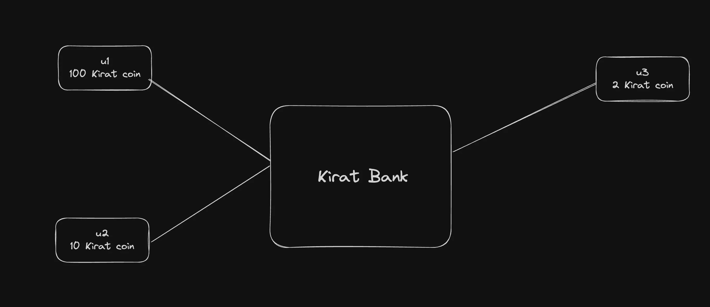
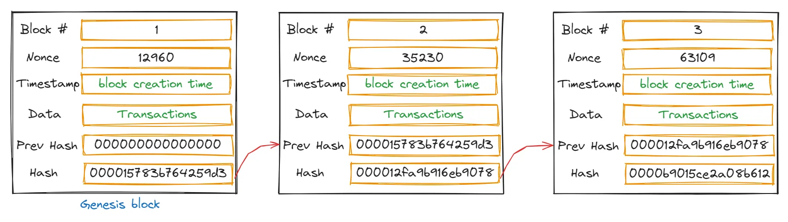
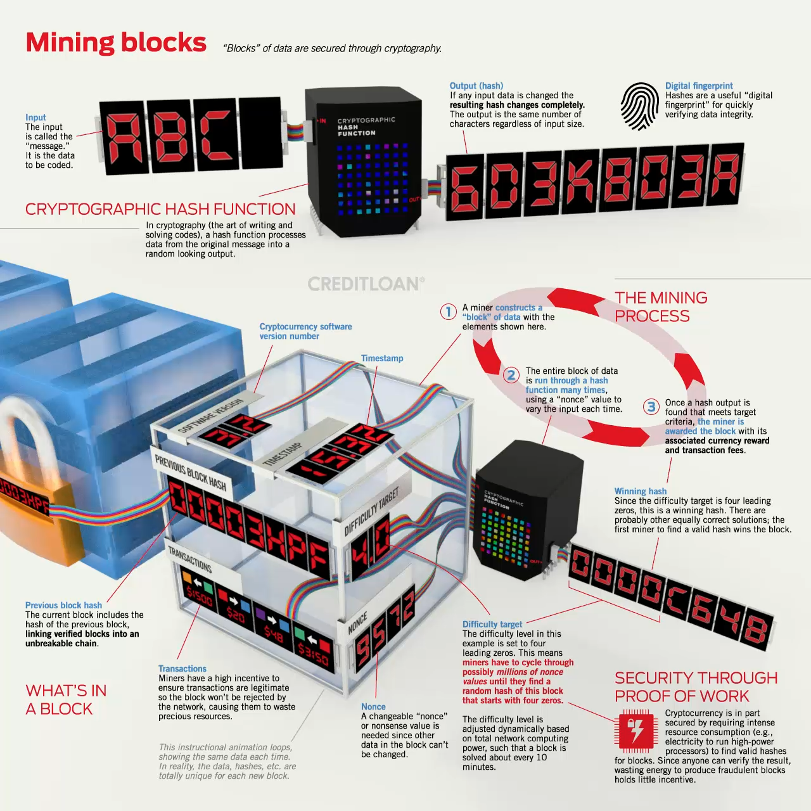
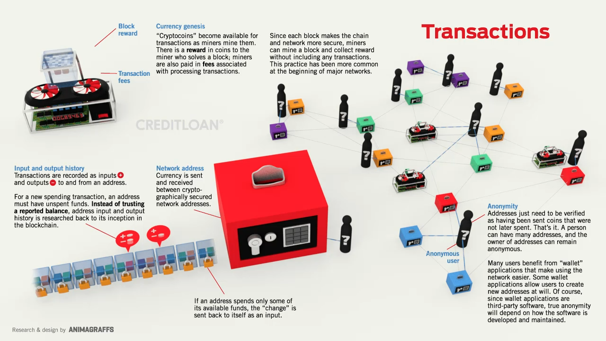
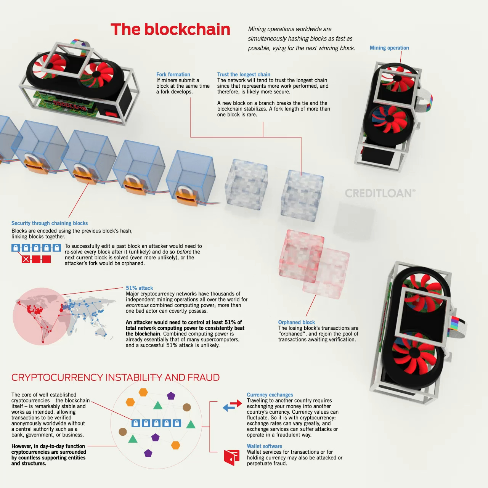
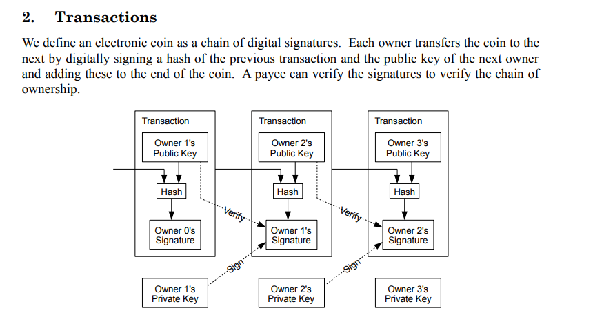

If it is centralized like kirat Coin

# Hashing
Hash functions have several important properties:
Deterministic: The same input will always produce the same output.
Fast computation: The hash value can be quickly computed for any given data.
Pre-image resistance: It should be computationally infeasible to reverse the hash function (i.e., find the original input given its hash output).
Small changes in input produce large changes in output: Even a tiny change in the input should drastically change the hash output.
Collision resistance: It should be computationally infeasible to find two different inputs that produce the same hash output.

Encryption is 2 way , I can reverse what was my input unlike Hashing

# BlockChain
Blockchain is a decentralized and distributed digital ledger that records transactions across many computers, ensuring data security and transparency.
It operates without a central authority (a bookmyshow website needs a server running ,  but we dont need that), using cryptographic techniques to verify and add new transactions.

## Purpose of Blockchain:
The purpose of blockchain is to create a network of computers that agree upon a common state of data. This ensures that:
Any person or organization can participate in the process.
No single person or organization can control the process.
Blockchain enables secure, transparent, and tamper-proof transactions without the need for a central authority.

## Key points:
Avoiding Central Ownership:
Centralized control over currency can lead to misuse of power and lack of transparency.
Blockchain technology eliminates the need for a central authority, distributing control among multiple nodes.
Trustless System:
Blockchain enables the creation of currency without needing to trust a central authority.
Transactions are verified by consensus mechanisms, ensuring security and integrity.
Anonymization:
Blockchain technology supports anonymized transactions, protecting the privacy of users while maintaining transparency of the overall system.
Decentralization:
Decentralized money operates on a network of nodes, preventing any single entity from having control and reducing the risk of manipulation or failure.
By leveraging these principles, blockchain technology allows for the creation of new currencies that are secure, transparent, and free from centralized control.

animation link -> https://animagraffs.com/how-cryptocurrency-works

# BitCoin WhitePaper (2008)
1. Introduction:
   Main Idea: The whitepaper introduces Bitcoin as a peer-to-peer version of electronic cash that allows online payments to be sent directly from one party to another without going through a financial institution.
   Problem Addressed: Traditional online payments rely on trusted third parties (banks, payment processors) to verify transactions. These intermediaries increase transaction costs and limit the possibility of truly small transactions (microtransactions).
2. Transactions:
   Core Concept: A transaction in Bitcoin is a transfer of ownership of coins from one user to another.
   Digital Signature: Each transaction is digitally signed using the sender’s private key and can be verified using their public key. This ensures that only the owner of the funds can authorize the transfer.
   Chain of Ownership: Transactions are structured in a chain format, where the ownership of the coins is transferred from one owner to the next through digital signatures.
   
3. Timestamp Server:
   Purpose: The system uses a timestamp server to prove the existence of a transaction at a particular point in time.
   Mechanism: The timestamp server takes a hash of a block of transactions and publicly announces it, effectively locking in the sequence of transactions. Each timestamp includes the previous one, forming a chain.
4. Proof-of-Work:
   Definition: Bitcoin uses a proof-of-work system to create a secure and tamper-proof ledger. Proof-of-work requires nodes (miners) to solve a difficult computational problem (finding a hash with a specified number of leading zeros).
   Block Creation: Miners compete to find a valid proof-of-work for their block of transactions. Once a valid solution is found, the block is added to the blockchain, and the miner is rewarded.
   Security: The difficulty of solving the proof-of-work problem secures the network by making it computationally impractical for an attacker to alter the blockchain.
5. Network:
   How it Works: Bitcoin operates on a decentralized peer-to-peer network. Here’s the process:
   New transactions are broadcast to all nodes.
   Nodes collect transactions into a block.
   Each node works on finding a proof-of-work for its block.
   When a node finds a valid block, it broadcasts the block to all nodes.
   Nodes accept the block if all transactions are valid and not already spent.
   Nodes begin working on the next block in the chain, using the hash of the accepted block.
   Consensus: The longest chain (the one with the most cumulative proof-of-work) is considered the valid chain. This ensures all nodes agree on a single, consistent history of transactions.
6. Incentive:
   Purpose: Bitcoin provides incentives to encourage network participation and secure the network.
   Mining Rewards: Miners are rewarded with newly created bitcoins and transaction fees from the transactions included in their block. This reward system aligns the miners' incentives with the network's security needs.
   Halving: Over time, the reward for mining new blocks decreases, following a predefined schedule (halving every 210,000 blocks, roughly every four years), eventually leading to a capped total supply of 21 million bitcoins.

Verification of Ownership
Verification Process:
The payee can verify the transaction’s authenticity by checking the chain of digital signatures.
This involves:
Verifying the Signatures: Ensuring each signature in the chain is legitimate by checking against the corresponding public key.
Verifying the Chain of Ownership: Tracing back the chain of transactions to confirm that the coin’s ownership has been validly transferred.

Chain of Ownership
Purpose: The chain of digital signatures serves as a record of ownership, proving that the current owner has legitimately acquired the coin.
Security: Ensures that the ownership of the coin is secure and can be verified without relying on a central authority.

Animation -> https://www.youtube.com/watch?v=NoqNhWnjE1Q&t=379s

