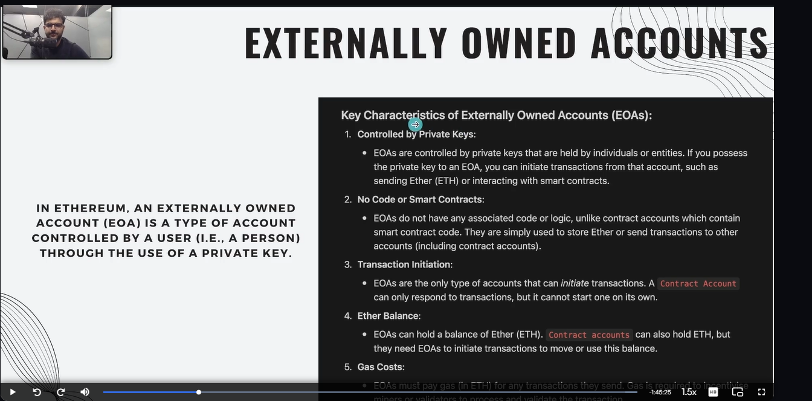
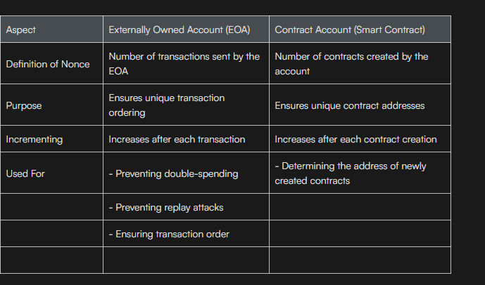
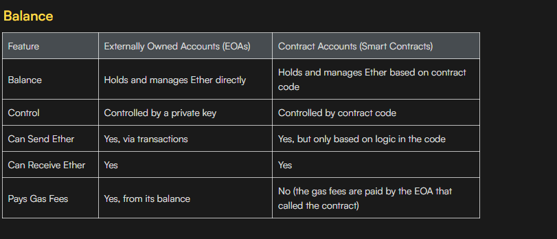
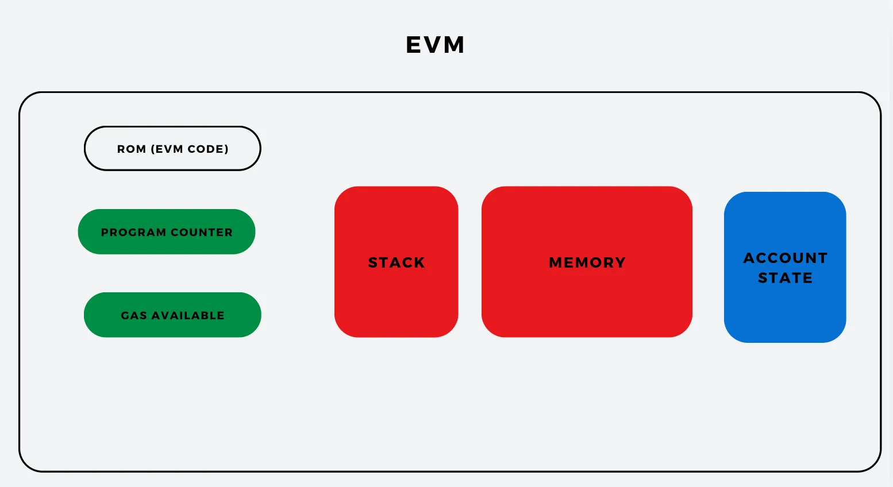

ETH as a State Machine
Ethereum is a state machine whose state changes as more blocks are added to the blockchain.
This means that Ethereum constantly updates its World State (the current situation of all accounts) whenever a new block of transactions is added.

## Nonce
Nonce for EOA: Think of it like your ticket number. Each time you do something (like buy a ticket), you get a new number to keep things organized and prevent reuse.
Nonce for Contract Account: Think of it like naming games. Each game has a unique name so that everyone knows which one is being referred to.
In both cases, the nonce helps keep everything organized and ensures that no mistakes happen, just like how unique ticket numbers and game names help manage a concert smoothly!

>  Bitcoin's nonce is a mining parameter used to find a valid block hash.

> Ethereum's nonce is a per-account transaction counter, not related to mining.

# ARCHITECTURE OF EVM (MEMORY, STORAGE AND CONTRACT)

Ethereum clients are software implementations that allow users to interact with the Ethereum blockchain. They enable nodes to participate in the network by verifying transactions, executing smart contracts, and maintaining a copy of the blockchain.

