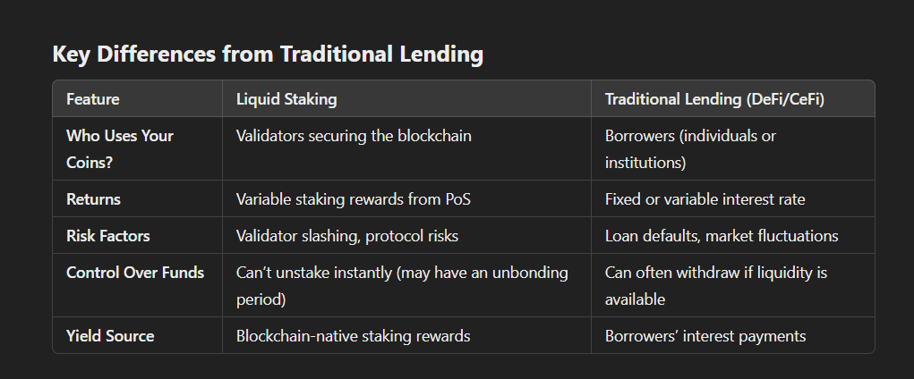

# Impermanet Loss
Impermanent loss happens when the price of your tokens changes while they’re in a liquidity pool. You might earn fees, but if prices swing too much, you can lose compared to just holding your tokens.

it is not permanent untill u withdraw the tokens  , price may balance back

In summary, we've learned about the processes of creating Liquidity Pools on Solana and how permissionless DEXs like Raydium allow for seamless token creation and low-level swaps. We discussed the differences between Solana and Ethereum, emphasizing how Solana’s built-in Token Program simplifies token creation compared to Ethereum’s need for custom smart contract deployment. Additionally, we explored liquidity pools, their mechanics, and the concept of impermanent loss, which occurs when token prices change in a pool. Lastly, we examined liquid staking and how it allows tokens to earn rewards while remaining usable in DeFi. Overall, this lecture provided us with a comprehensive understanding of token creation, trading, and staking on decentralized platforms.

Summary of ETH Delegation Flow
1️⃣ User stakes ETH → Sends to a liquid staking smart contract.
2️⃣ ETH is pooled → Combined with others’ ETH.
3️⃣ Protocol delegates ETH to validators → Validators validate transactions.
4️⃣ Validators earn rewards → Rewards are sent back to the protocol.
5️⃣ User earns rewards → Reflected in liquid staking tokens.
6️⃣ User can unstake by selling liquid tokens or waiting for a withdrawal.

