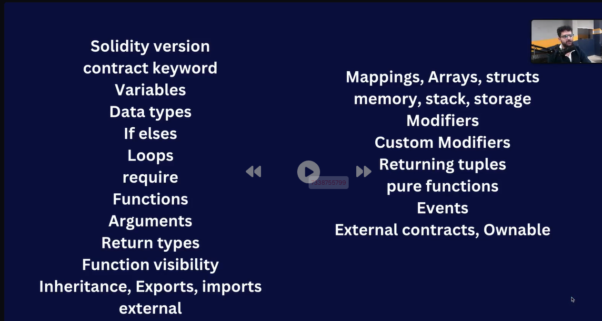
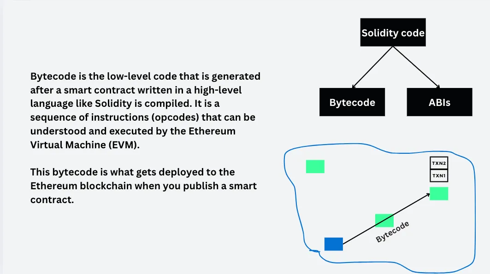
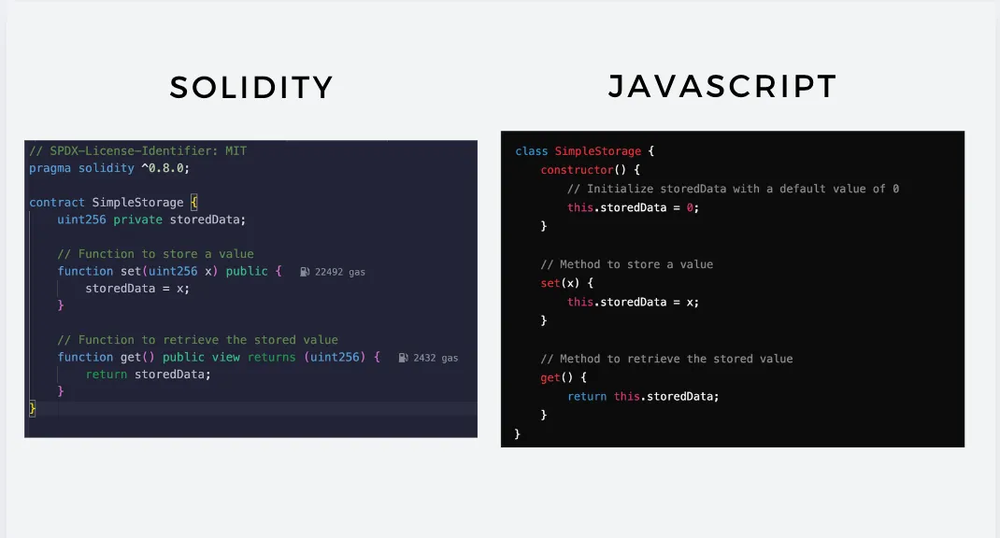
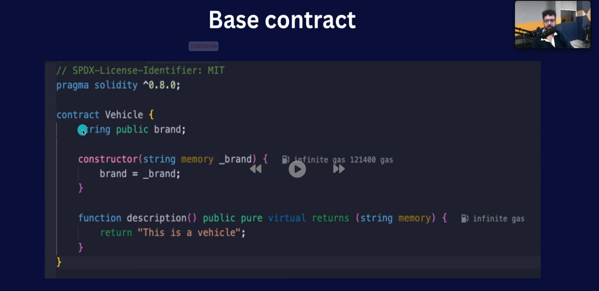
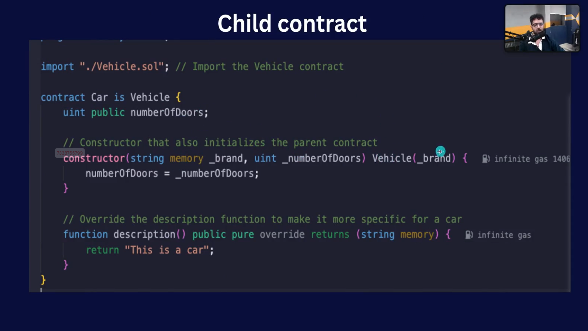

syllabus for week 15 > SOLIDITY

ABIs and Bytecode

## ABIs

**In Ethereum, an ABI (Application Binary Interface) is a standardized way for interacting with smart contracts. It defines how data should be encoded and decoded when being sent to and from a contract on the Ethereum blockchain.**

## Inheritance 

onenote link -> https://1drv.ms/o/c/5c7043df4646cc8b/EkraqzvPt7xKnGDNbUB7I98BM1SYtOakFnEdcor_qe9UiA?e=buHgR7

