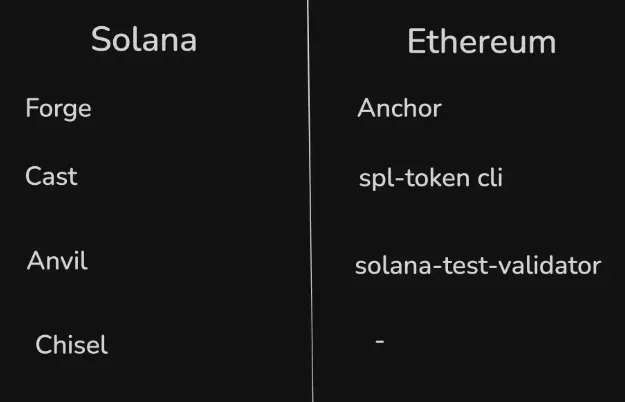
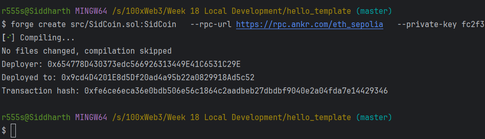

Ganache
Ganache is used for starting/creating ethereum blockchain locally for testing.
It is similar to solana-test-validator that lets you start solana locally
Truffle
A world class development environment, testing framework and asset pipeline for blockchains using the Ethereum Virtual Machine (EVM), aiming to make life as a developer easier.
Note: For now we dont use Ganache & Truffle use any more
Hardhat
Hardhat is a development environment for Ethereum that helps you write, test, and deploy smart contracts.
Why it's useful over Ganache and Truffle:
It allows you to run a local Ethereum blockchain (like Ganache) and also provides debugging tools.
You can write smart contracts and test them easily using JavaScript (JS) or TypeScript (TS).
Contract and Test in JS or TS:
Smart Contracts: Written in Solidity, but the testing and interaction with contracts are done in JavaScript or TypeScript.
Testing: You write test scripts in JS or TS to interact with your deployed contracts, check for correct behavior, and simulate transactions.
In short, Hardhat gives you a local blockchain to test your smart contracts and lets you write and test everything in JavaScript or TypeScript.

# Foundry
Foundry is another tool used for smart contract development, testing, and deployment. It's known for being fast and efficient, especially for testing smart contracts.
It has 4 parts
Forge: Ethereum testing framework (like Truffle, Hardhat).
Cast: Swiss army knife for interacting with EVM smart contracts, sending transactions and getting chain data.
Anvil: Local Ethereum node, akin to Ganache, Hardhat Network.
Chisel: Fast, utilitarian, and verbose solidity REPL.

* Indexed parameters (like from and to) are special because they are searchable and can be used to quickly find specific events. Think of them like keywords or tags for events.

Real-Life Analogy:
vm.prank(address): You borrow a friend’s ID for one store visit.
vm.startPrank(address): You borrow your friend’s ID for all the stores you visit that day.
vm.stopPrank(): You stop using your friend’s ID and go back to using your own.
Summary
vm.hoax: Temporarily changes the sender of a transaction for just one operation.
vm.deal: Sets a specific balance for an address in your test environment.
vm.prank, vm.startPrank, vm.stopPrank: Used for impersonating an address either for one or multiple transactions.

