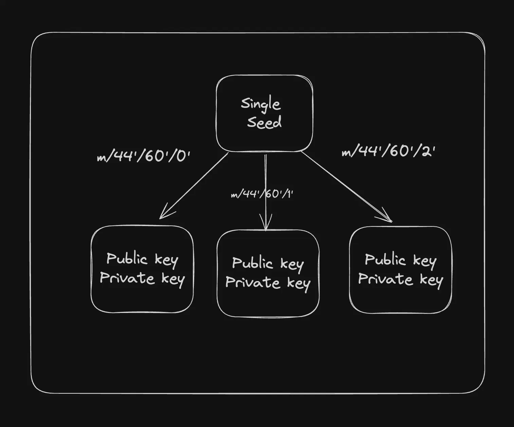

# Public Key CryptoGraphy

Encodings
Bytes are cool but highly unreadable. Imagine telling someone
Hey, my name is 00101011101010101020

It’s easier to encode data so it is more human readable . Some common encodings include -
Ascii
Hex
Base64
Base58

Ascii
1 character = 7 bits
Every byte corresponds to a text on the computer .
Here is a complete list - https://www.w3schools.com/charsets/ref_html_ascii.asp#:~:text=The ASCII Character Set&text=ASCII is a 7-bit,are all based on ASCII.
Bytes to Ascii
Ascii to bytes
UInt8Array to ascii
Ascii to UInt8Array
notion image

Hex
1 character = 4 bits
A single hex character can be any of the 16 possible values: 0-9 and A-F.
Array to hex
Hex to array

Base64
1 character = 6 bits
Base64 encoding uses 64 different characters (A-Z, a-z, 0-9, +, /), which means each character can represent one of 64 possible values.

Encode

Base58
It is similar to Base64 but uses a different set of characters to avoid visually similar characters and to make the encoded output more user-friendly
Base58 uses 58 different characters:
Uppercase letters: A-Z (excluding I and O)
Lowercase letters: a-z (excluding l)
Numbers: 1-9 (excluding 0)
+ , /
  Encode
  Decode

Ascii vs UTF-8
ASCII uses a 7-bit encoding scheme.
UTF-8 uses 1 to 4 bytes to encode each character.

## Hashing vs encryption

### Hashing
Hashing is a process of converting data (like a file or a message) into a fixed-size string of characters, which typically appears random.
Common hashing algorithms - SHA-256, MD5 
It is irreversible

### Encryption
Encryption is the process of converting plaintext data into an unreadable format, called ciphertext, using a specific algorithm and a key. The data can be decrypted back to its original form only with the appropriate key.

Symmetric encryption: The same key is used for both encryption and decryption.
Asymmetric encryption: Different keys are used for encryption (public key) and decryption (private key).

## Asymetric Encryption
Asymmetric encryption, also known as public-key cryptography, is a type of encryption that uses a pair of keys: a public key and a private key. The keys are mathematically related, but it is computationally infeasible to derive the private key from the public key.
Public Key: The public key is a string that can be shared openly
Private Key: The private key is a secret cryptographic code that must be kept confidential. It is used to decrypt data encrypted with the corresponding public key or to create digital signatures.

### Common Asymmetric Encryption Algorithms:
RSA - Rivest–Shamir–Adleman
ECC - Elliptic Curve Cryptography (ECDSA) - ETH and BTC
EdDSA - Edwards-curve Digital Signature Algorithm  - SOL

Common eleptic curves
secp256k1 - BTC and ETH
ed25519 - SOL

How eliptic curves work - https://www.youtube.com/watch?v=NF1pwjL9-DE&

> You can get a public key from a private key but vice-versa is not possible

# Hierarchical Deterministic (HD) Wallet

Hierarchical Deterministic (HD) wallets are a type of wallet that can generate a tree of key pairs from a single seed.  This allows for the generation of multiple addresses from a single root seed, providing both security and convenience.

 

