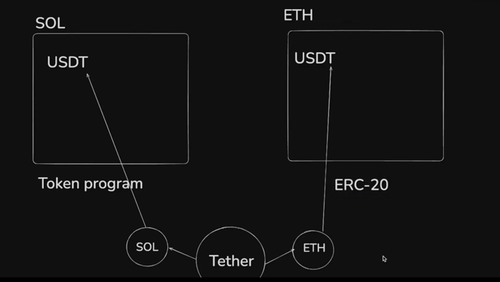
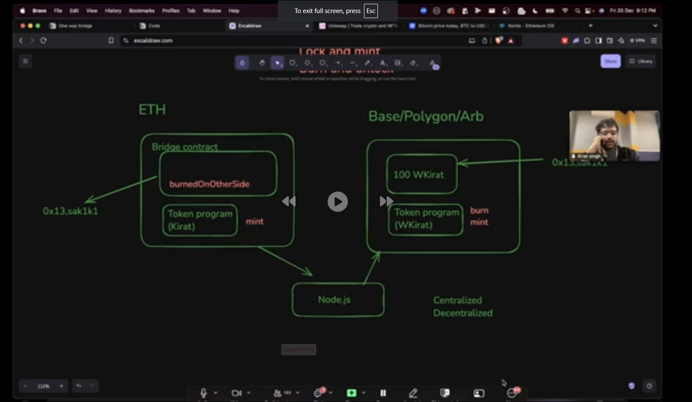

Bridges
A bridge is like a tunnel that connects two different blockchains, allowing you to send things (like money or tokens) from one blockchain to another. Each blockchain is like its own city, and bridges let people move between cities.
A bridge is a protocol (a set of rules) that enables communication and transfers between two blockchains. Each blockchain has its own set of rules, but the bridge helps translate and ensure value moves securely.

# Example

USDT on Solana:
Solana uses its Token Program to manage tokens like USDT.
This USDT exists on Solana’s blockchain (native to Solana).
USDT on Ethereum:
On Ethereum, USDT follows the ERC-20 standard, which is specific to Ethereum's blockchain.
Tether as the Common Entity:
Tether acts as the central issuer of USDT, ensuring the total supply is balanced across multiple blockchains (like Solana and Ethereum).
The Role of Bridges:
To move USDT from Solana to Ethereum:
USDT on Solana is locked or burned via a bridge.
An equivalent amount of USDT is released or minted on Ethereum, following the ERC-20 standard.

#

How an EVM Bridge Works:
Lock and Mint (Token Bridge):
Locking: When a user wants to move assets (e.g., tokens) from one blockchain to another (say, from Ethereum to Binance Smart Chain), the assets are "locked" in a smart contract on the source blockchain (Ethereum). The original tokens are not moved; they are simply secured in the contract until they are redeemed or unlocked.
Minting: Once the assets are locked, the bridge's smart contract on the destination blockchain (BSC, for example) will mint an equivalent number of tokens. These minted tokens represent the value that the user can now use on the destination blockchain.
Burn and Release:
When the user wants to move assets back to the source blockchain (say, from BSC to Ethereum), they initiate a process where the tokens on the destination blockchain are "burned" (destroyed).
After the tokens are burned, the bridge’s smart contract on the source blockchain (Ethereum) will release the equivalent amount of tokens back to the user.

