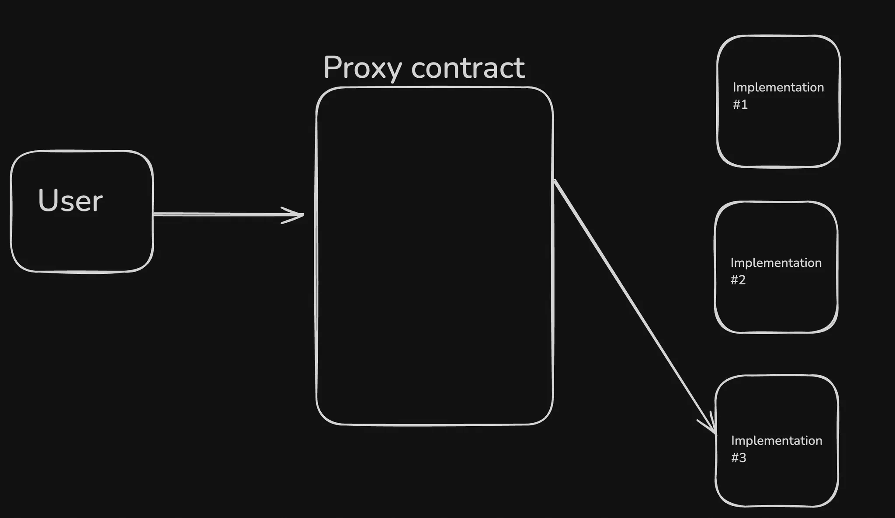

# **Upgradability in Ethereum Contracts**

### Key Points:

While immutability is important for ensuring security and trust, there are scenarios where the ability to upgrade a contract is desirable, such as:

- **Bug Fixes**: Fixing vulnerabilities or logical flaws in the contract.
- **New Features**: Adding new functionality or features.
- **Optimizations**: Improving performance or reducing costs.

Without upgradability, once deployed, a smart contract is effectively "set in stone."

# delegateCall

In Solidity, `delegatecall` is a low-level function used to execute code from another contract while maintaining the context (i.e., storage, msg.sender, msg.value) of the calling contract.

`delegatecall` is a special type of message call used to execute functions of another contract, but it runs in the context of the calling contract. This means:

- The code of the target contract is executed.
- The target contract’s code is executed as though it’s part of the calling contract.
- The **state** (storage) and other context (like `msg.sender` and `msg.value`) are maintained from the calling contract.

# **Proxy Pattern**

The most common design pattern for upgradable contracts is the *Proxy Pattern*. This involves separating the contract's data (storage) and logic (code).

# Storage layout

When using `delegatecall`, the **implementation contract’s code** is executed in the **proxy’s storage context**. For that to work properly, the **storage layout** in the proxy must match the **storage layout** in the implementation.

However, in your `StorageProxy`, you’ve inherited from OpenZeppelin’s `Ownable`, which adds its own storage variables—specifically `_owner`. This shifts around your storage slots in a way that your `ImplementationvX` contracts do not account for.

# fallback Function

In Ethereum, the fallback function is a special function in a smart contract that is executed when the contract receives Ether and there is no other matching function signature for the call made. It is part of the low-level function set in Solidity and is commonly used for handling Ether transfers, handling unexpected function calls, or implementing custom logic for receiving Ether.

- It is **marked as `external`** and **payable** if it needs to accept Ether.
- It can be used to handle incoming Ether, execute arbitrary code, or forward calls to other contracts.

<aside>
💡

There is another function called `receive` that is triggered only when ether is received.

</aside>

# Common Proxy patterns

There are three common `patterns` to do proxies/upgradable contracts in ETH.

1. Transparent proxy
2. Universal Upgradeable Proxy Standard (UUPS )
3. Beacon Proxy Pattern

# Transparent proxy

A **transparent proxy** in Ethereum (ETH) refers to a specific type of proxy contract that acts as an intermediary between a user and the actual logic or functionality of a smart contract, while remaining "transparent" in the sense that users or other contracts are unaware that they are interacting with a proxy instead of the underlying contract directly.

### **Simple Proxy vs Transparent proxy**

A **simple proxy** (often called a basic proxy) typically uses **delegatecall** to forward calls to another contract (implementation). However, it doesn't have the protections or additional features that come with the transparent proxy pattern:

- **Lack of transparency**: If the user interacts with a basic proxy, they may have more visibility into the proxy behavior, or the proxy could expose implementation-specific details.
- **Admin visibility**: In some proxies, the admin can interact with the contract through the same functions as the user, potentially making it more difficult to distinguish between admin-level functionality and regular contract behavior.

UUPS stores the `admin` logic directly in the implementation contract instead of storing it the `Proxy` contract.

A Beacon Proxy is an upgradeable proxy pattern that allows multiple proxies to share a single upgradeable implementation. Instead of each proxy contract managing its own implementation, a "Beacon" contract dictates which implementation all proxies use.

