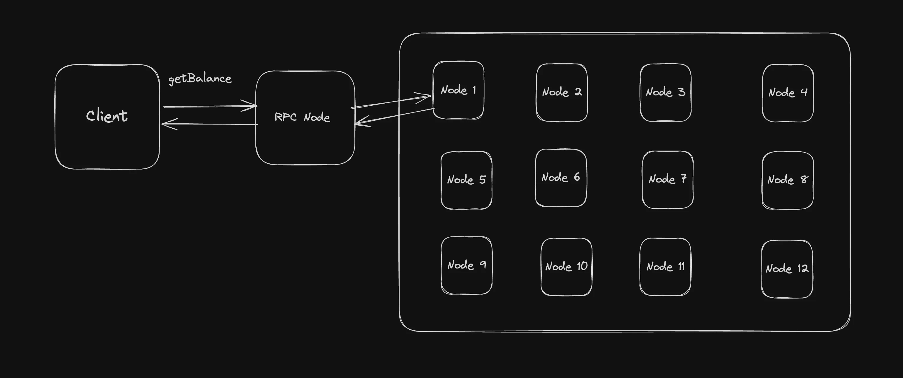

## RPC Server

An RPC server provides a way for external clients to interact with the blockchain network. RPC stands for Remote Procedure Call, and an RPC server exposes an API that allows clients to send requests and receive responses from the blockchain.
An RPC server is a service that listens for JSON-RPC requests from clients, processes these requests, and returns the results. It acts as an intermediary between the blockchain and external applications or services.

Wei, Lamports
ETH
Wei:
Definition: Wei is the smallest unit of cryptocurrency in the Ethereum network. It's similar to how a cent is to a dollar.
Value: 1 Ether (ETH) = 10^18 Wei.
Gwei
Definition: A larger unit of Ether commonly used in the context of gas prices.
Conversion: 1 Ether = 10^9 gwei
Lamports
In the Solana blockchain, the smallest unit of currency is called a lamport. Just as wei is to Ether in Ethereum, lamports are to SOL (the native token of Solana).
1 SOL = 10 ^ 9 Lamports

    

## keccak-256
Collision resistance: Keccak256 is designed to be collision-resistant, meaning finding two inputs that produce the same hash output should be extremely difficult. However, it's important to note that collision resistance is not absolute, and there is always a small chance of collision. Therefore, it's recommended to use a combination of unique input parameters (e.g., block hash + block timestamp + contract nonce) for a lower probability of collision.
Pre-image resistance: Keccak256 is also designed to be pre-image resistant, meaning it should be nearly impossible to determine the original input from the hash output. However, it's important to note that brute-force attacks can still be attempted, and stronger passwords or keys will increase security.
Key length: Keccak256 outputs a 256-bit hash value, which means that it has a very large output space. This makes it resistant to brute-force attacks, but it's important to ensure that the key length is also sufficient for the application.
Implementation: It's important to ensure that the implementation of Keccak256 used is secure and free from vulnerabilities. Additionally, the implementation should be updated regularly to ensure that any discovered vulnerabilities are patched.

