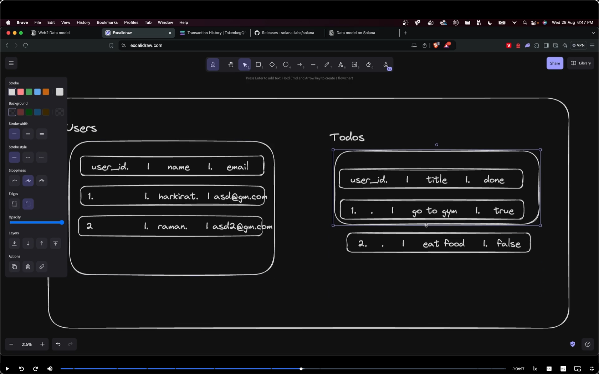
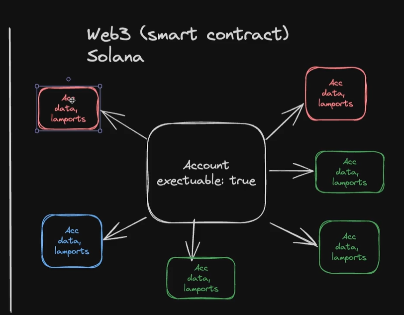
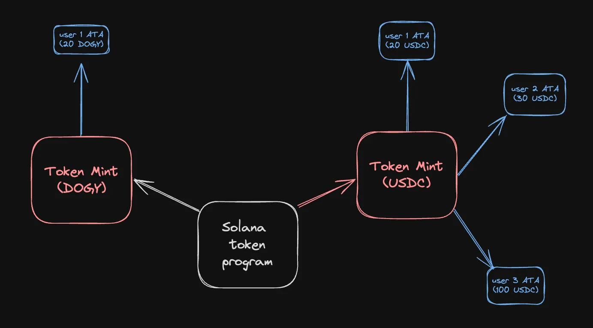
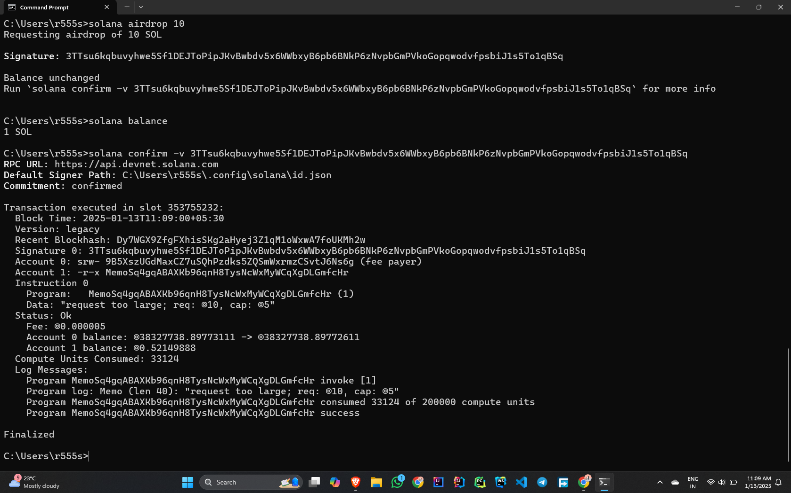

## Programs/Smart contracts
ETH was one of the first blockchains to introduce the concept of decentralized state / programs. These are popularly known as smart contracts on the ETH blockchain.

 ## Data model on Solana
making a atodo app in web2 world looks like

whereas in solana

each color is one user and they have to pay their colour respective prices/charges for storing the data

Transactions
A transaction in Solana is a bundle that includes one or more instructions. Transactions are used to submit operations or changes to the network. They can be simple, such as transferring SOL between accounts, or complex
Instructions
The core operations that the transaction will execute.

There are more concepts like recentBlockchash and signers , writeable that we we will eventually get to.

## Creating a Token

The Key Difference:
Coins are like the main money of the digital world, and you use them to pay for things on their blockchain.
Tokens are special items that can do different things, like act as tickets, give you voting power, or represent cool stuff (like a game item or collectible).

Simple Example:
Coin: Like having real money (like dollars or coins) that you can use anywhere.
Token: Like having a special game token that lets you buy things in your favorite game, but it’s not money you can use anywhere else.
In short, coins are the main money of a blockchain, and tokens are like special items or points that can do cool things on the blockchain!

