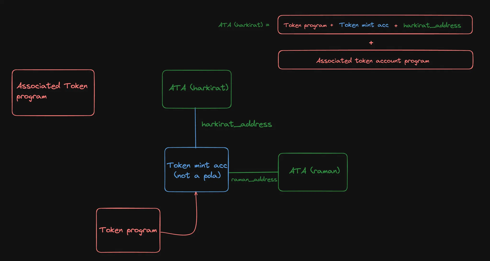
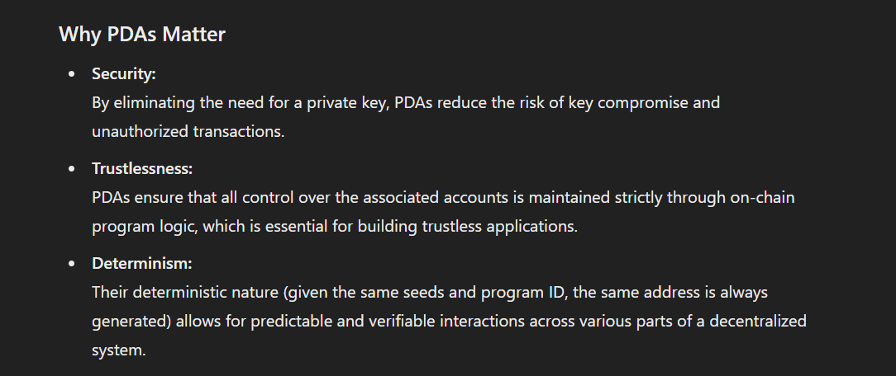

# Program derived addresses

Program Derived Addresses (PDAs) provide developers on Solana with two main use cases:

- **Deterministic Account Addresses**: PDAs provide a mechanism to deterministically derive an address using a combination of optional "seeds" (predefined inputs) and a specific program ID.
- **Enable Program Signing**: The Solana runtime enables programs to "sign" for PDAs which are derived from its program ID.

## Properties

- PDAs are addresses derived deterministically using
    - a combination of user-defined seeds
    - a bump seed
    - and a program's ID.
- PDAs are addresses that fall off the Ed25519 curve and have no corresponding private key.
- Solana programs can programmatically "sign" for PDAs that are derived using its program ID.
- Deriving a PDA does not automatically create an on-chain account.
- An account using a PDA as its address must be explicitly created through a dedicated instruction within a Solana program.

# Real-World Use Cases of PDAs

1. Escrow and Conditional Payment Systems:

How It Works: A PDA can serve as an escrow account where funds are held until certain conditions are met (e.g., delivery of goods or fulfillment of a contract).
Example: In a decentralized marketplace, a buyer’s payment might be sent to a PDA-controlled escrow. Once the seller fulfills their obligations, the program releases the funds from the PDA to the seller.

2. NFT Minting and Metadata Management:

How It Works: PDAs can be used during the minting process of Non-Fungible Tokens (NFTs) to securely manage minting rights or to store immutable metadata.
Example: An NFT platform may generate a PDA for each minting event. The PDA then serves as the canonical record for the NFT’s metadata, ensuring that once minted, the NFT’s details remain tamper-proof.

3. Automated Reward Distribution and Staking Mechanisms:

How It Works: For protocols that distribute rewards (such as staking platforms or liquidity mining programs), PDAs can automatically handle the accumulation and distribution of rewards based on pre-programmed logic.
Example: In a staking protocol, rewards earned by staked tokens might be collected in a PDA. The program periodically distributes these rewards to users, following the rules encoded in the smart contract.

